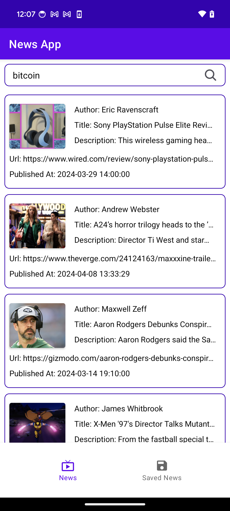
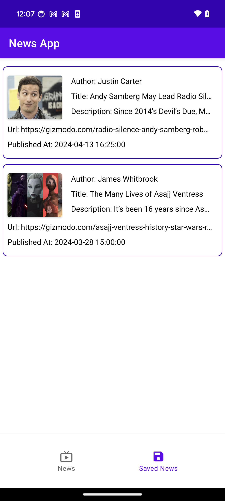
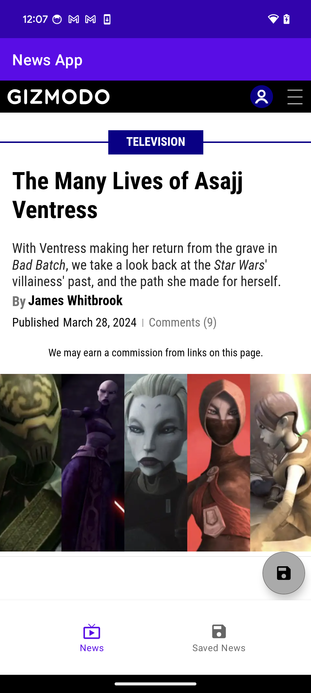

#News App Task

 

    
    

 

## Architecture
* Built with MVVM Clean Architecture

## Built With 🛠
- [Kotlin](https://kotlinlang.org/) - Official programming language for Android development.
- [Room](https://developer.android.com/jetpack/androidx/releases/room) - The Room persistence library provides an abstraction layer over SQLite to allow for more robust database access while harnessing the full power of SQLite.
- [DataBinding](https://developer.android.com/topic/libraries/data-binding) - Support library that allows to bind UI components.
- [Navigation component](https://developer.android.com/guide/navigation/navigation-getting-started) - Navigation refers to the interactions that allow users to navigate across, into, and back out from the different pieces of content within your app.
- [Hilt](https://dagger.dev/hilt/) -Hilt provides a standard way to incorporate Dagger dependency injection into an Android application.
- [Coroutines](https://developer.android.com/kotlin/coroutines) - A coroutine is a concurrency design pattern that you can use on Android to simplify code that executes asynchronously.
- [LiveData](https://developer.android.com/topic/libraries/architecture/livedata) - LiveData is an observable data holder class. Unlike a regular observable, LiveData is lifecycle-aware.
- [Retrofit](https://square.github.io/retrofit/) - A type-safe HTTP client for Android and Java.
- [Glide](https://github.com/bumptech/glide) - Glide is a fast and efficient open source media management and image loading framework for Android.
- [NEWS API](https://newsapi.org/) -Locate articles and breaking news headlines from news sources and blogs across the web with our JSON API.
